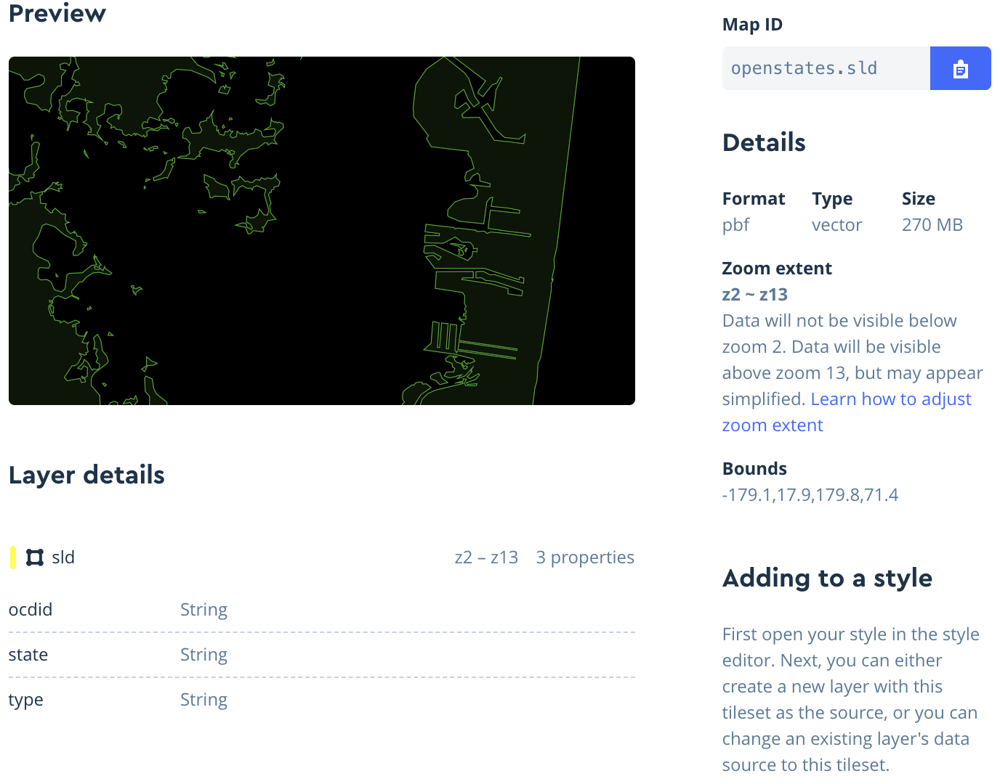

# Issues

- Tracked in our central issue repository: [Geo Issues](https://github.com/openstates/issues/labels/component%3Ageo)

# Open States Geography Processing & Server

Generate and upload map tiles for the state-level legislative district maps on [openstates.org](https://openstates.org/), both for [state overviews](https://openstates.org/ca/) and for [individual legislators](https://openstates.org/person/tim-ashe-4mV4UFZqI2WsxsnYXLM8Vb/).

- Source: SLDL and SLDU shapefiles from [the Census's TIGER/Line database](https://www.census.gov/geo/maps-data/data/tiger-line.html)
- Output: a single nationwide MBTiles vector tile set, uploaded to Mapbox for hosting
  - Intermediate files are also built and retained locally, stored in the `data` directory for debugging



## Dependencies

- Python 3 and `poetry`
- GDAL 2
- `tippecanoe`

## Ensuring The Right Shape Files

~We download our shapefiles from [census.gov](https://www2.census.gov/geo/tiger). We should make sure we're using the most recent year available and update the `YEAR` variable in `scripts/get-shapefiles.py` and `scripts/make-tiles.py`.~

~You'll probably want to remove any cached files in `./data/source`, `./data/mapbox`, and `./data/geojson`. The download tool may try to re-use cached files from the wrong year if they still exist. (We don't manually remove these files because you may need to re-run the scripts, and skipping downloads is useful)~

Util TIGER is updated, we are manually downloading files from [here](https://redistrictingdatahub.org/dataset/standardized-2022-district-shapefiles-by-state/).

We extract these files to data/source_cache folder in subdirectories with the following pattern:

`<JURISDICTION_ABBR(upper case)>_<sldu|sldl|cong|cd>_<suffix>`

Each state should have at least two folders, and most should have three.

```for-example
$ ls data/source_cache/
AK_cong_boundary  DE_cong_boundary  IN_sldl_boundary  MI_sldu_boundary  NH_sldl_boundary  OR_sldu_boundary  UT_cong_boundary
AK_sldl_boundary  DE_sldl_boundary  IN_sldu_boundary  MN_cong_boundary  NH_sldu_boundary  PA_cong_boundary  UT_sldl_boundary
AK_sldu_boundary  DE_sldu_boundary  KS_cong_boundary  MN_sldl_boundary  NJ_cong_boundary  PA_sldl_boundary  UT_sldu_boundary
AL_cong_boundary  FL_cong_boundary  KS_sldl_boundary  MN_sldu_boundary  NJ_sldl_boundary  PA_sldu_boundary  VA_cong_boundary
AL_sldl_boundary  FL_sldl_boundary  KS_sldu_boundary  MO_cong_boundary  NJ_sldu_boundary  pr_sldl_2022      VA_sldl_boundary
AL_sldu_boundary  FL_sldu_boundary  KY_cong_boundary  MO_sldl_boundary  NM_cong_boundary  pr_sldu_2022      VA_sldu_boundary
AR_cong_boundary  GA_cong_boundary  KY_sldl_boundary  MO_sldu_boundary  NM_sldl_boundary  RI_cong_boundary  VT_cong_boundary
AR_sldl_boundary  GA_sldl_boundary  KY_sldu_boundary  MS_cong_boundary  NM_sldu_boundary  RI_sldl_boundary  VT_sldl_boundary
AR_sldu_boundary  GA_sldu_boundary  LA_cong_boundary  MS_sldl_boundary  NV_cong_boundary  RI_sldu_boundary  VT_sldu_boundary
AZ_cong_boundary  HI_cong_boundary  LA_sldl_boundary  MS_sldu_boundary  NV_sldl_boundary  SC_cong_boundary  WA_cong_boundary
AZ_sldl_boundary  HI_sldl_boundary  LA_sldu_boundary  MT_cong_boundary  NV_sldu_boundary  SC_sldl_boundary  WA_sldl_boundary
AZ_sldu_boundary  HI_sldu_boundary  MA_cong_boundary  MT_sldl_boundary  NY_cong_boundary  SC_sldu_boundary  WA_sldu_boundary
CA_cong_boundary  IA_cong_boundary  MA_sldl_boundary  MT_sldu_boundary  NY_sldl_boundary  SD_cong_boundary  WI_cong_boundary
CA_sldl_boundary  IA_sldl_boundary  MA_sldu_boundary  NC_cong_boundary  NY_sldu_boundary  SD_sldl_boundary  WI_sldl_boundary
CA_sldu_boundary  IA_sldu_boundary  MD_cong_boundary  NC_sldl_boundary  OH_cong_boundary  SD_sldu_boundary  WI_sldu_boundary
CO_cong_boundary  ID_cong_boundary  MD_sldl_boundary  NC_sldu_boundary  OH_sldl_boundary  TN_cong_boundary  WV_cong_boundary
CO_sldl_boundary  ID_sldl_boundary  MD_sldu_boundary  ND_cong_boundary  OH_sldu_boundary  TN_sldl_boundary  WV_sldl_boundary
CO_sldu_boundary  ID_sldu_boundary  ME_cong_boundary  ND_sldl_boundary  OK_cong_boundary  TN_sldu_boundary  WV_sldu_boundary
CT_cong_boundary  IL_cong_boundary  ME_sldl_boundary  ND_sldu_boundary  OK_sldl_boundary  TX_cong_boundary  WY_cong_boundary
CT_sldl_boundary  IL_sldl_boundary  ME_sldu_boundary  NE_cong_boundary  OK_sldu_boundary  TX_sldl_boundary  WY_sldl_boundary
CT_sldu_boundary  IL_sldu_boundary  MI_cong_boundary  NE_sldu_boundary  OR_cong_boundary  TX_sldu_boundary  WY_sldu_boundary
dc_sldu_2022      IN_cong_boundary  MI_sldl_boundary  NH_cong_boundary  OR_sldl_boundary  us_cd_2022-tiger
```

## Running

There are several steps, which typically need to be run in order:

1) Setup Poetry:

  `poetry install`

2) Download SLD shapefiles:

  `poetry run ./scripts/get-shapefiles.py`

3) Convert to geojson with division IDs:

  `poetry run ./scripts/to-geojson.py`

4) Make sure `DATABASE_URL` is set to local database in `djapp/geo/settings.py`


5) Migrate database to add needed tables:

  `poetry run ./manage.py migrate`

6) Import into database:

  `poetry run ./manage.py load_divisions`

7) Convert to mbtiles and upload:

  `./scripts/make-tiles.py`

  The `MAPBOX_ACCOUNT` name and `MAPBOX_ACCESS_TOKEN` (with upload privileges) must be set as environment variables. If not, then the upload step will be skipped.

8) Currently, we have to manually upload the resulting tilesets to [Mapbox](https://studio.mapbox.com/tilesets/). We'll need to upload `data/sld.mbtiles` and `data/cd.mbtiles`.

### Running within Docker

Instead of setting up your local environment you can instead run using Docker. Using Docker Compose will still allow you to access all intermediate files from the processing, within your local `data` directory.

Build and run with Docker Compose. Similar to running without Docker, the `MAPBOX_ACCOUNT` and `MAPBOX_ACCESS_TOKEN` must be set in your local environment.

```
docker-compose up make-tiles
```
